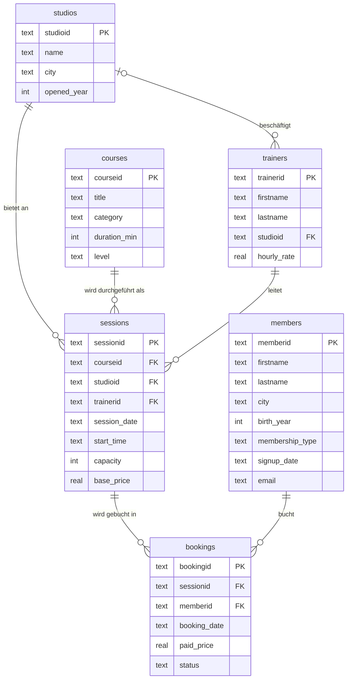

# fitness.db — Fitnesskette «MoveFit» (fiktiv)

Datenbank für die Übungen `10_…ap01` und `11_probepruefung_ap01`. Sie ist wie `cinema.db` aus der Prüfung AP01
aufgebaut: 6 Tabellen, ca. 3000 Zeilen, mit eingebauten Datenqualitätsproblemen. Alle Daten sind frei erfunden und
lassen sich mit `python Uebungen/tools/generate_fitness_db.py` neu erzeugen.

## ER-Diagramm

## Tabellen

| Tabelle | Zeilen | Inhalt |
|---|---|---|
| `studios` | 6 | Standorte. `ST06` (MoveFit Wankdorf) ist neu und hat noch keine Kurstermine und keine Trainer. |
| `courses` | 15 | Kursangebot mit Kategorie (Yoga, Ausdauer, Kraft, Pilates, Tanz, Gesundheit). `CO15` (Aqua Fit) wurde noch nie durchgeführt. |
| `trainers` | 30 | Trainerinnen und Trainer mit Stammstudio. `TR030` ist freischaffend (`studioid` NULL). |
| `sessions` | 300 | Kurstermine Januar–Juni 2026 mit Kapazität und Listenpreis `base_price` (CHF). |
| `members` | 505 | Mitglieder. Gültige `membership_type`: `Basic`, `Premium`, `Student`, `Senior`. |
| `bookings` | 2000 | Buchungen mit tatsächlich bezahltem Preis `paid_price` (CHF) und `status` (`attended`, `no-show`, `cancelled`). |

## Spalten

| Spalte | Bedeutung |
|---|---|
| `sessions.base_price` | Listenpreis des Termins (im Studio Oerlikon/Zürich CHF 3.– Zuschlag) |
| `bookings.paid_price` | tatsächlich bezahlter Betrag (Rabatte: Premium 20 %, Student 25 %, Senior 15 %, 10er-Abo 10 %, Gutscheine) |
| `bookings.status` | `attended` = teilgenommen, `no-show` = nicht erschienen (bezahlt), `cancelled` = storniert (zurückerstattet) |
| `session_date`, `booking_date`, `signup_date` | Datum als Text im Format `JJJJ-MM-TT` |

## Hinweise

- In PostgreSQL rundet `ROUND(x, 2)` nur Werte vom Typ `NUMERIC`: `ROUND(CAST(AVG(paid_price) AS NUMERIC), 2)`.
- Die Datenqualitätsprobleme sind Absicht. Sie zu finden, ist Teil der Übungen.
